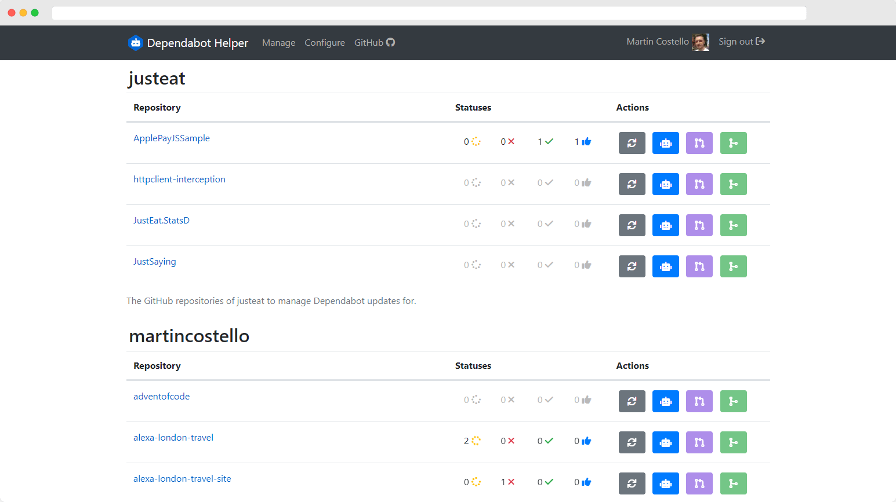

# Dependabot Helper

> [!IMPORTANT]  
> Dependabot Helper is no longer maintained. It is provided as-is for archival purposes only.
> It may contain bugs and security issues, and should not be used in production environments.

[](#introduction)

## Introduction

_Dependabot Helper_ is an ASP.NET Core application that helps manage [Dependabot]
updates across GitHub multiple repositories.

[Dependabot]: https://docs.github.com/en/code-security/dependabot/dependabot-version-updates/about-dependabot-version-updates

Dependabot Helper integrates with the [GitHub API] via [OAuth] to interact with
selected repositories acting as your user account to manage pull requests
generated by bots, such as the [dependabot bot] and the [github-actions bot].

[dependabot bot]: https://github.com/apps/dependabot
[github-actions bot]: https://github.com/apps/github-actions
[GitHub API]: https://docs.github.com/en/rest/guides/getting-started-with-the-rest-api
[OAuth]: https://docs.github.com/en/developers/apps/building-oauth-apps/scopes-for-oauth-apps

For more information, please refer to the [documentation].

[documentation]: ./docs#readme

## Debugging

> [!WARNING]
> Do not commit GitHub OAuth secrets to source control. Configure them with [User Secrets] instead.

To debug the application locally outside of the integration tests, you will need
to [create a GitHub OAuth app] to obtain secrets for the `GitHub:ClientId` and
`GitHub:ClientSecret` [options] so that the [OAuth user authentication] works and
you can log into the Dependabot Helper UI. GitHub Enterprise Server is also supported.

> [!TIP]
> When creating the GitHub OAuth app, use `https://localhost:5001/sign-in-github` as the _Authorization callback URL_.

[create a GitHub OAuth app]: https://docs.github.com/developers/apps/building-oauth-apps/creating-an-oauth-app
[OAuth user authentication]: https://docs.microsoft.com/aspnet/core/security/authentication/social/
[options]: https://github.com/martincostello/dependabot-helper/blob/94582086890c18579d6462825d13cca62669ce7d/src/DependabotHelper/appsettings.json#L11-L12
[User Secrets]: https://docs.microsoft.com/aspnet/core/security/app-secrets

## Building and Testing

Compiling the application yourself requires Git and the
[.NET SDK](https://dotnet.microsoft.com/download "Download the .NET SDK")
to be installed.

To build and test the application locally from a terminal/command-line, run the
following set of commands:

```powershell
git clone https://github.com/martincostello/dependabot-helper.git
cd dependabot-helper
./build.ps1
```

## Feedback

Any feedback or issues can be added to the issues for this project in
[GitHub](https://github.com/martincostello/dependabot-helper/issues "Issues for this project on GitHub.com").

## Repository

The repository is hosted in
[GitHub](https://github.com/martincostello/dependabot-helper "This project on GitHub.com"):
<https://github.com/martincostello/dependabot-helper.git>

## License

This project is licensed under the
[Apache 2.0](http://www.apache.org/licenses/LICENSE-2.0.txt "The Apache 2.0 license")
license.
