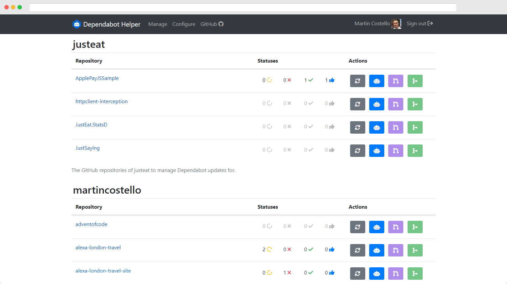

# Dependabot Helper

## Introduction

[Dependabot] is a great tool built into GitHub, but if you configure it to run
regularly across a large number of repositories, or it generates a lot of pull
requests each time it runs, the notifications it generates can be a bit
overwhelming and time-consuming to keep on top of.

[Dependabot]: https://docs.github.com/en/code-security/dependabot/dependabot-version-updates/about-dependabot-version-updates

_Dependabot Helper_ tries to make this more manageable by providing you with a
summary view of all the automated pull requests generated by the
`app/dependabot` and `app/github-actions` users against all of the repositories
you have access to that you choose to configure to manage updates for.

## Features

- Integrates with the [GitHub REST API].
- Acts as you via GitHub [OAuth] tokens (the default scopes are `repo` and `user:email`).
- Works with both GitHub.com and [GitHub Enterprise Server] (_tested with GHES 3.2_).
- Supports being hosted as a web application and as an [AWS Lambda function].
- Configure access to your own repositories as well as organizations you are a member of.
  - Optionally supports private repositories and forks.
- View open pull requests created by specific users for each configured repository:
  - See the status of pull request checks and statuses.
  - See the number of approvals.
  - Approve individual pull requests.
  - Merge all mergeable pull requests at once.

[AWS Lambda function]: https://aws.amazon.com/blogs/compute/introducing-the-net-6-runtime-for-aws-lambda/
[GitHub Enterprise Server]: https://docs.github.com/en/enterprise-server/admin
[GitHub REST API]: https://docs.github.com/en/rest/guides/getting-started-with-the-rest-api
[OAuth]: https://docs.github.com/en/developers/apps/building-oauth-apps/scopes-for-oauth-apps

## Screenshots

### Configure repositories

### Pull requests summary

### View pull requests

## API Access and Data Storage

Users/organizations and repositories are cached in-memory for 10 minutes by
default to improve performance and improve GitHub API quota utilization. This
can be disabled for ephemeral deployments, such as AWS Lambda.

The repositories you select to manage are stored in your browser's local storage.

Your GitHub OAuth access token is stored encrypted in the web application's
authentication cookie.

You can audit the code for yourself, but the GitHub OAuth access token acquired
for your user when you log into the application is only used to:

- Get the organizations to which you have access.
- Get the repositories which belong to your account and to which you have access in the organizations you are a member of.
- Query issues and pull requests.
- Query commit checks and statuses.
- Query pull request approvals.
- Check if a repository contains a `.github/dependabot.yml` file.
- Approve pull requests.
- Merge pull requests.

## Configuration

The following configuration settings are available to change the behaviour of
the application.

| Key | Type | Default | Description |
|:--|:--|:--|:--|
| `Dependabot:CacheLifetime` | `TimeSpan` | `00:10:00` | The period users, organizations and repositories are cached for. |
| `Dependabot:DisableCaching` | `bool` | `false` | Disables caching of users, organizations and repositories in memory. |
| `Dependabot:IncludeForks` | `bool` | `false` | Whether to show forked repositories. |
| `Dependabot:IncludePrivate` | `bool` | `false` | Whether to show private and internal repositories. |
| `Dependabot:Labels` | `string[]` | `[ "dependencies" ]` | The label(s) pull requests must have to be shown. |
| `Dependabot:MergeRetryWaits` | `TimeSpan[]` | `[ "00:00:01", "00:00:02" ]` | The period(s) to wait when attempting to merge pull requests if merge fails as the pull request is not mergeable. |
| `Dependabot:RefreshPeriod` | `TimeSpan` | `00:10:00` | The approximate interval after which the status of the configured repositories is refreshed. |
| `Dependabot:Users` | `string[]` | `[ "app/dependabot", "app/github-actions" ]` | The users(s) pull requests must be created by to be shown. |
| `GitHub:ClientId` | `string` | - | The client ID for the GitHub OAuth application to use. |
| `GitHub:ClientSecret` | `string` | - | The client secret for the GitHub OAuth application to use. |
| `GitHub:EnterpriseDomain` | `string` | - | The URL of a GitHub Enterprise Server instance to use instead of GitHub.com. |
| `GitHub:Scopes` | `string[]` | `[ "repo", "user:email" ]` | The scopes to request for the OAuth token when a user authenticates with the application. |

<!--
| `` | `` | `` | |
-->
